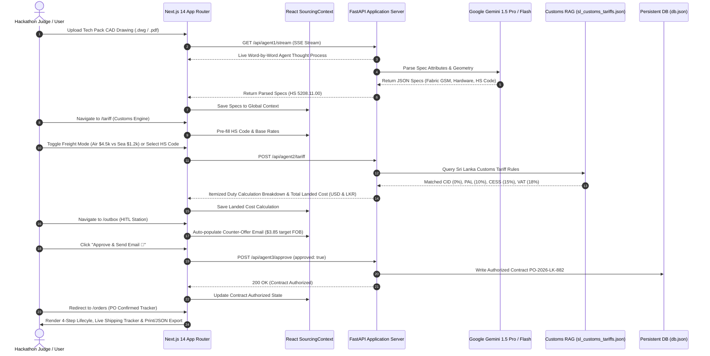

# VentureWing — Autonomous Global Sourcing & Sri Lanka Customs Intelligence AI Platform

> **Submission for IDEALIZE 2026 Hackathon (Open Category)**  
> **Team Name**: Team Aviate (SLIIT & NIBM)  
> **Platform Version**: Release 2.0.0 (Enterprise Polish & Multi-Agent RAG Stack)

---

## 🚀 Executive Summary

**VentureWing** is a production-grade, multi-agent full-stack B2B SaaS procurement application designed for boutique apparel brands and Sri Lankan apparel export ecosystems. By replacing manual tech pack parsing, spreadsheet customs calculations, and email negotiation back-and-forth, VentureWing automates end-to-end global sourcing while strictly keeping humans in the loop for financial security.

---

## 🏗️ End-to-End System Sequence Diagram



### System Architecture ASCII Flow

```
                       +---------------------------------------+
                       |         VentureWing Next.js 14        |
                       |       App Router & React Context      |
                       +-------------------+-------------------+
                                           |
                               REST & SSE / Axios API
                                           |
                       +-------------------+-------------------+
                       |      FastAPI Backend Engine (Python)  |
                       +---------+---------+---------+---------+
                                 |         |         |
          +----------------------+         |         +-----------------------+
          |                                |                                 |
 +--------v--------+             +---------v-------+              +----------v----------+
 |  Agent 01:      |             |  Agent 02:      |              |  Agent 03:          |
 |  Vision & Spec  |             |  Customs Tariff |              |  Negotiator Engine  |
 |  Extractor (SSE)|             |  & RAG Engine   |              |  & HITL Guardrail   |
 +-----------------+             +--------+--------+              +----------+----------+
                                          |                                  |
                                 +--------v--------+                +--------v--------+
                                 | Vector Database |                | Persistent Store|
                                 | sl_customs_     |                | backend/data/   |
                                 | tariffs.json    |                | db.json         |
                                 +-----------------+                +-----------------+
```

---

## 🏆 Judges Evaluation Quickstart Guide

Follow these steps to evaluate each component of VentureWing:

### Step 1: Landing Page & UN SDG Mission (`/`)
- Open `http://localhost:3000/`.
- Review the UN Sustainable Development Goals Cards:
  - **SDG 8 (Decent Work & Economic Growth)**: Local manufacturer matching in Colombo with zero-duty transparency.
  - **SDG 9 (Industry, Innovation & Infrastructure)**: Modernizing cross-border trade via vector database customs tax automation.
- Click **"Launch Platform"** to enter the workspace.

### Step 2: Agent 01 SSE Vision Streaming (`/ingestion`)
- Click **"Run Live Vision Parsing"**.
- Watch the live **SSE Server-Sent Events Thought Process Stream** log word-by-word execution in the console window.
- Click hotspot pins on the **CAD Blueprint Viewer** (`Fabric`, `Hardware`, `Tolerance`) to test interactive spec card highlighting.
- Click **"Proceed to Supplier Matching"**.

### Step 3: Supplier Discovery Matrix (`/suppliers`)
- Review 3-column supplier cards (Zhejiang China 98%, Tex Vanguard Vietnam 85%, Ceylon Garments Sri Lanka 78% with **ZERO IMPORT DUTY** badge).
- Click **"Calculate Sri Lanka Tariff"** on the Zhejiang card.

### Step 4: Agent 02 Customs Tariff RAG & Freight Switcher (`/tariff`)
- Test the **Searchable HS Code Dropdown** (5 apparel codes: `5208.11.00`, `6109.10.00`, `6204.62.00`, `6110.20.00`, `6205.20.00`).
- Toggle between **"Sea Freight"** (14 days, $1,200) and **"Air Freight"** (3 days, $4,500). Observe instant recalculation of CID, PAL (10%), CESS (15%), VAT (18%), and final Landed Cost in LKR.
- Click **"Initiate AI Negotiation"**.

### Step 5: Agent 03 HITL Safety Guardrail Station (`/outbox`)
- Observe the top amber **Human-In-The-Loop Security Banner** (`⚠️ OUTBOUND BLOCKED`).
- Inspect the auto-populated email counter-offer proposing **$3.85 USD FOB** (projected annual impact: +$42,500 USD).
- Click **"Approve & Send Email 🚀"**. The backend verifies authorization and logs contract `PO-2026-LK-882` to `db.json`.

### Step 6: Confirmed Purchase Order Tracker & Export (`/orders`)
- Verify green authorization banner (`✓ Supplier Agreed to $3.85/unit`).
- Test **"Print PO"** (`window.print()`) and **"Export PO (JSON)"** file download.

### Step 7: Persistent Audit History (`/dashboard`)
- Return to `/dashboard` to view the **Past Sourcing Audits & Signed Contracts** table populated dynamically from `GET /api/history`.

---

## 🤖 Multi-Agent AI System Architecture

VentureWing coordinates three specialized AI agents to execute complex B2B sourcing workflows:

1. **Agent 01: Vision Ingestion & Tech Pack CAD Parser (`backend/agents/agent1_ingestion.py`)**
   - Parses CAD drawings using Gemini Multimodal Vision and streams thoughts via SSE `/api/agent1/stream`.
2. **Agent 02: Customs Tariff Calculation & Vector RAG Engine (`backend/agents/agent2_tariff_rag.py`)**
   - Retrieves Sri Lanka Customs tariff rules from vector-indexed dataset (`backend/data/sl_customs_tariffs.json`).
3. **Agent 03: Negotiation Strategy Generator & HITL Security Station (`backend/agents/agent3_negotiator.py`)**
   - Enforces human sign-off via FastAPI middleware (`/api/agent3/approve`) and saves contracts into `backend/data/db.json`.

---

## 🛠️ Local Setup & Quickstart Guide

### Prerequisites
- Node.js 18.x or 20.x
- Python 3.10 or higher

### 1. Frontend Setup (Next.js 14)
```bash
npm install
npm run dev
```
Open [http://localhost:3000](http://localhost:3000) in your browser.

### 2. Backend Setup (FastAPI Python)
```bash
pip install -r backend/requirements.txt
uvicorn backend.main:app --reload --port 8000
```
Open [http://localhost:8000/docs](http://localhost:8000/docs) to view interactive Swagger API documentation.

---

## 👥 Team Aviate — IDEALIZE 2026 Submission

- **Panapitiya P.D.A.S.** (SLIIT) — *System Architect*
- **Sammandapperuma S.M.A.D.V.** (NIBM) — *Full-Stack Engineer*
- **Obeysekara R.A.T.P.** (SLIIT) — *AI Lead*
- **Silva K.D.R.** (NIBM) — *UI/UX Specialist*

---

*Powered by Google Gemini 1.5 Pro/Flash, Next.js 14, and Python FastAPI. Developed for IDEALIZE 2026 Open Category.*
