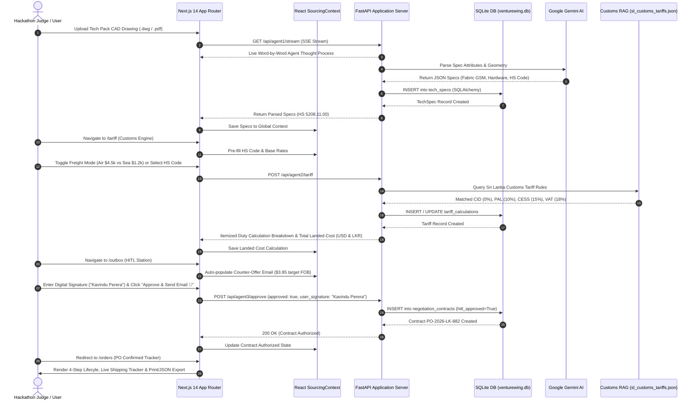

# VentureWing — Autonomous Global Sourcing & Sri Lanka Customs Intelligence AI Platform

> **Submission for IDEALIZE 2026 Hackathon (Open Category)**  
> **Team Name**: Team Aviate (SLIIT & NIBM)  
> **Platform Version**: Release 3.0.0 (SQLite Database & SQLAlchemy ORM Relational Backend)

---

## 🚀 Executive Summary

**VentureWing** is a production-grade, multi-agent full-stack B2B SaaS procurement application designed for boutique apparel brands and Sri Lankan apparel export ecosystems. Powered by Next.js 14, Python FastAPI, Google Gemini AI, and a real persistent **SQLite Relational Database** (`venturewing.db`), VentureWing automates end-to-end global sourcing while strictly keeping humans in the loop with digital sign-off compliance.

---

## 🗄️ Relational Database ERD Schema Diagram

VentureWing implements 4 relational SQL tables managed via SQLAlchemy ORM:

```
+-------------------+           +-------------------+
|      Project      | 1       * |     TechSpec      |
+-------------------+-----------+-------------------+
| id (PK)           |           | id (PK)           |
| name              |           | project_id (FK)   |
| category          |           | fabric_type       |
| status            |           | hardware          |
| created_at        |           | tolerance         |
+---------+---------+           | hs_code           |
          |                     +-------------------+
          | 1
          |
          | *                   +------------------------+
          +---------------------+   TariffCalculation    |
          |                     +------------------------+
          |                     | id (PK)                |
          |                     | project_id (FK)        |
          |                     | units                  |
          |                     | fob_unit_usd           |
          | 1                   | freight_total_usd      |
          |                     | cid_usd, pal_usd, CESS |
          | *                   | vat_usd, total_landed  |
+---------+--------------+      +------------------------+
| NegotiationContract   |
+------------------------+
| id (PK)                |
| project_id (FK)        |
| target_fob_usd         |
| email_body             |
| hitl_approved          |
| user_signature         |
| po_number              |
+------------------------+
```

---

## 🏗️ End-to-End System Sequence Diagram



### System Architecture ASCII Flow

```
                       +---------------------------------------+
                       |         VentureWing Next.js 14        |
                       |       App Router & React Context      |
                       +-------------------+-------------------+
                                           |
                               REST & SSE / Axios API
                                           |
                       +-------------------+-------------------+
                       |      FastAPI Backend Engine (Python)  |
                       +---------+---------+---------+---------+
                                 |         |         |
          +----------------------+         |         +-----------------------+
          |                                |                                 |
 +--------v--------+             +---------v-------+              +----------v----------+
 |  Agent 01:      |             |  Agent 02:      |              |  Agent 03:          |
 |  Vision & Spec  |             |  Customs Tariff |              |  Negotiator Engine  |
 |  Extractor (SSE)|             |  & RAG Engine   |              |  & HITL Guardrail   |
 +--------+--------+             +--------+--------+              +----------+----------+
          |                               |                                  |
          +-------------------------------+----------------------------------+
                                          |
                                 +--------v--------+
                                 | SQLite Database |
                                 | venturewing.db  |
                                 | (SQLAlchemy)    |
                                 +-----------------+
```

---

## 🏆 Judges Evaluation Quickstart Guide

Follow these steps to evaluate each component of VentureWing:

### Step 1: Landing Page & UN SDG Mission (`/`)
- Open `http://localhost:3000/`.
- Review UN Sustainable Development Goals Alignment:
  - **SDG 8 (Decent Work & Economic Growth)**: Local manufacturer matching in Colombo with zero-duty transparency.
  - **SDG 9 (Industry, Innovation & Infrastructure)**: Modernizing cross-border trade via vector database customs tax automation.
- Click **"Launch Platform"** to enter the workspace.

### Step 2: Workspace Command Center & Live SQLite DB (`/dashboard`)
- View live project records queried directly from SQLite database table `projects` via `GET /api/projects`.
- Check top header badge: `SQLite DB: Connected (venturewing.db)`.
- Click **"Run Agent 01 Ingestion"**.

### Step 3: Agent 01 SSE Vision Streaming & DB Write (`/ingestion`)
- Click **"Run Live Vision Parsing"**.
- Watch the live **SSE Server-Sent Events Thought Process Stream** log word-by-word execution in the console window.
- Backend writes parsed record into SQLite table `tech_specs`.
- Click hotspot pins on the **CAD Blueprint Viewer** (`Fabric`, `Hardware`, `Tolerance`) to test interactive spec card highlighting.
- Click **"Proceed to Supplier Matching"**.

### Step 4: Supplier Discovery Matrix (`/suppliers`)
- Review 3-column supplier cards (Zhejiang China 98%, Tex Vanguard Vietnam 85%, Ceylon Garments Sri Lanka 78% with **ZERO IMPORT DUTY** badge).
- Click **"Calculate Sri Lanka Tariff"** on the Zhejiang card.

### Step 5: Agent 02 Customs Tariff RAG & DB Write (`/tariff`)
- Test the **Searchable HS Code Dropdown** (5 apparel codes: `5208.11.00`, `6109.10.00`, `6204.62.00`, `6110.20.00`, `6205.20.00`).
- Toggle between **"Sea Freight"** (14 days, $1,200) and **"Air Freight"** (3 days, $4,500). Observe instant recalculation of CID, PAL (10%), CESS (15%), VAT (18%), and final Landed Cost in LKR.
- Backend writes tariff calculation into SQLite table `tariff_calculations`.
- Click **"Initiate AI Negotiation"**.

### Step 6: Agent 03 HITL Safety Station & Digital Sign-Off (`/outbox`)
- Observe top amber **Human-In-The-Loop Security Banner** (`⚠️ OUTBOUND BLOCKED`).
- Inspect auto-populated email counter-offer proposing **$3.85 USD FOB** (projected annual impact: +$42,500 USD).
- Enter human digital signature (`Kavindu Perera`) and click **"Approve & Write to SQLite DB"**.
- Backend verifies authorization and writes record into SQLite table `negotiation_contracts` (`hitl_approved=True`).

### Step 7: Confirmed Purchase Order Tracker & Export (`/orders`)
- Verify green authorization banner (`✓ Supplier Agreed to $3.85/unit`).
- Test **"Print PO"** (`window.print()`) and **"Export PO (JSON)"** file download.

---

## 🛠️ Local Setup & Quickstart Guide

### Prerequisites
- Node.js 18.x or 20.x
- Python 3.10 or higher

### 1. Frontend Setup (Next.js 14)
```bash
npm install
npm run dev
```
Open [http://localhost:3000](http://localhost:3000) in your browser.

### 2. Backend Setup (FastAPI + SQLite Database)
```bash
pip install -r backend/requirements.txt
uvicorn backend.main:app --reload --port 8000
```
Open [http://localhost:8000/docs](http://localhost:8000/docs) to view interactive Swagger API documentation. The SQLite database `venturewing.db` is created automatically on startup.

---

## 👥 Team Aviate — IDEALIZE 2026 Submission

- **Panapitiya P.D.A.S.** (SLIIT) — *System Architect*
- **Sammandapperuma S.M.A.D.V.** (NIBM) — *Full-Stack Engineer*
- **Obeysekara R.A.T.P.** (SLIIT) — *AI Lead*
- **Silva K.D.R.** (NIBM) — *UI/UX Specialist*

---

*Powered by Google Gemini 1.5 Pro/Flash, Next.js 14, Python FastAPI, and SQLite / SQLAlchemy ORM. Developed for IDEALIZE 2026 Open Category.*
